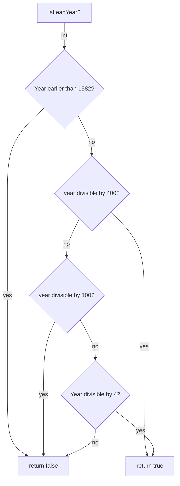

# assignment-0

Assignment created as part of Analysis, Design and Software architecture, on 3rd semester of the Software development bachelor, at ITU

Further documentation found in `docs/report.pdf`

Report made in LaTeX with Overleaf.[LaTeX source found here](https://www.overleaf.com/read/kzphzfhfqbsh)

## Flowchart

